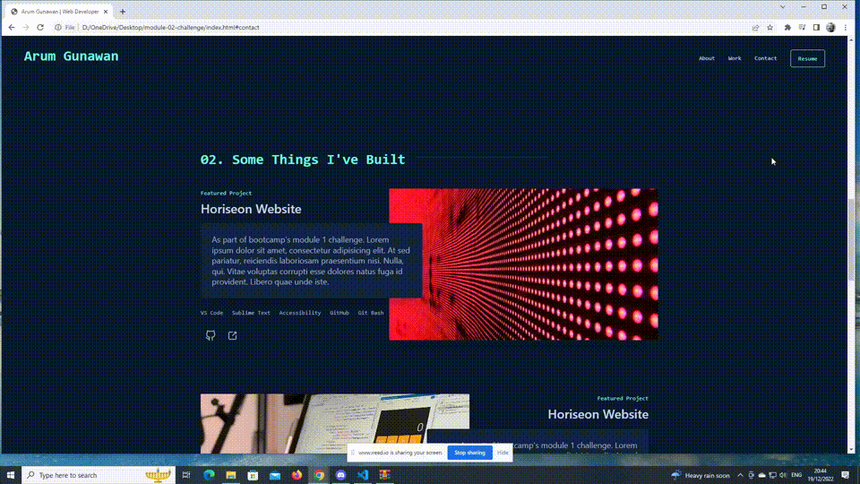
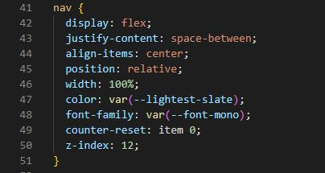
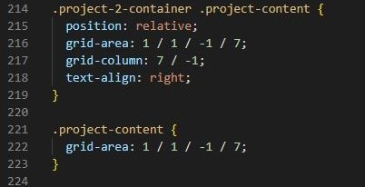

# Module 02 Challenge | Portofolio

  

 

## Description

A simple, clean and responsive html portfolio page showing all my work and knowledge, technologies used, as well as links to my different social media accounts and downloadable resume. The portofolio consists of author's background description, author's project experience, and lastly the contact information. More information regarding projects completed will be added in time.

 

## Features

This page features a fully responsive User interface, with working links to both existing projects, deployed and running live on github, as well as active repositories and own linkedIn page.

### Flexbox

Flexbox has been used to make the website more responsive. An instance of the flexbox that has been used:

### Grid
CSS Grid has been used to adjust contents on work section and give it a pattern.

Hence, the website looks as below:

### Z-index Property
Z-index has been used to adjust the items order in z-axis. In order to bring the image behind the text, the project description z-index has been set as 2 whilst the z-index of the project image is 1. The result can be seen below:

### Clickable SVG
SVG icons have been used in order to make links more attractive and user friendly. Links have been attached to SVG element by following this code:

So, the SVG icons look as shown below:

 

## Table of Contents

* [Installation](#installation)
* [Usage](#usage)
* [Credits](#credits)
* [License](#license)

 

## Installation

Installation not required at the moment, since this is a "plug and play" type of application. The user can simply run it locally by clicking on the "index.html" file and opening in either their default or preferred browser.

 

## Usage 

Simply click on the links required to be sent to the relevant piece of information.

 

## Credits

* SVG icons are obtained from [iconduck](https://iconduck.com/).
* Z-index on work section is based on [CSS z-index Property](https://www.w3schools.com/cssref/pr_pos_z-index.php#:~:text=The%20z%2Dindex%20property%20specifies,with%20a%20lower%20stack%20order.) tutorial by [w3schools](https://www.w3schools.com/).
* Font and color palette are inspired from [Portofolio](https://brittanychiang.com/) by [Brittany Chiang](https://github.com/bchiang7/).

 

## License

Licensed under the [MIT license](https://github.com/git/git-scm.com/blob/main/MIT-LICENSE.txt). See LICENSE for the full details.